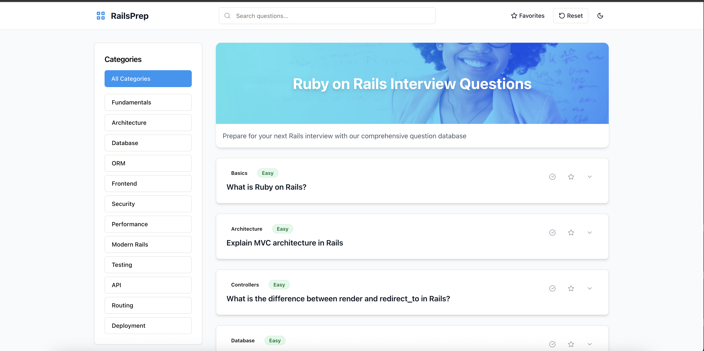

# RailsInterviewPro

<div align="center">


</div>

## Overview

RailsInterviewPro is a comprehensive Ruby on Rails interview preparation platform designed to help developers prepare for technical interviews. With an extensive collection of 199+ hand-crafted questions across different difficulty levels and categories, this application serves as a one-stop resource for mastering Rails concepts.

## Screenshot

<div align="center">
  
  <p><i>The RailsInterviewPro interface showing question cards, filtering options, and search capabilities</i></p>
</div>

## Features

- **Comprehensive Question Database**: 199+ Rails and Ruby questions spanning basic to advanced topics
- **Difficulty Levels**: Questions organized as Easy, Medium, and Hard for progressive learning
- **Category Filters**: Browse questions by specific topics like ActiveRecord, Architecture, Modern Rails, etc.
- **Search Functionality**: Quickly find questions on specific topics
- **Favorites System**: Mark questions for later review
- **Progress Tracking**: Mark questions as completed as you study
- **Responsive Design**: Works seamlessly on desktop and mobile devices
- **Modern UI**: Clean, intuitive interface for distraction-free learning

## Categories

- Basics
- Architecture
- ActiveRecord
- Controllers
- Views
- Routing
- Database
- Performance
- Security
- Testing
- Modern Rails (Rails 7+ features)
- API
- Deployment
- Ruby
- Gems
- Frontend

## Technical Stack

### Backend
- Node.js with Express
- TypeScript
- SQLite (development) / PostgreSQL via NeonDB (production)
- Drizzle ORM

### Frontend
- React
- TypeScript
- TanStack Query for data fetching
- Tailwind CSS for styling

## Installation

### Prerequisites
- Node.js (v16+)
- npm or yarn

### Setup
1. Clone the repository:
   ```bash
   git clone https://github.com/yourusername/RailsInterviewPro.git
   cd RailsInterviewPro
   ```

2. Install dependencies:
   ```bash
   npm install
   ```

3. Start the development server:
   ```bash
   npm run dev
   ```

4. Open your browser and navigate to:
   ```
   http://localhost:5001
   ```

## Environment Variables

For production deployment, set the following environment variables:

```
DATABASE_URL=your_postgres_connection_string
```

Without a DATABASE_URL, the application will fall back to an in-memory SQLite database.

## API Endpoints

| Endpoint | Method | Description |
|----------|--------|-------------|
| `/api/questions` | GET | Retrieve all questions or filter by difficulty |
| `/api/questions/:id` | GET | Get a specific question by ID |
| `/api/user-preferences/:userId` | GET | Get user's preferences (favorites, completed) |
| `/api/user-preferences` | POST | Update user preferences |

### Query Parameters

- `/api/questions?difficulty=easy` - Filter questions by difficulty (easy, medium, hard)

## Contributing

Contributions are welcome! Please feel free to submit a Pull Request.

1. Fork the repository
2. Create your feature branch (`git checkout -b feature/amazing-feature`)
3. Commit your changes (`git commit -m 'Add some amazing feature'`)
4. Push to the branch (`git push origin feature/amazing-feature`)
5. Open a Pull Request

## License

This project is licensed under the MIT License - see the LICENSE file for details.

## Acknowledgements

- Questions sourced from various Ruby on Rails resources and interview experiences
- Special thanks to the Ruby on Rails community

---

<div align="center">
Made with ❤️ for the Rails community
</div> 